# Contoso Retail -- Client Executive Report

**Prepared for:** Contoso Retail Leadership Team
**Date:** June 29, 2026
**Period Analyzed:** January 2016 -- February 2021
**Prepared by:** Data Analytics Team

---

## Letter from the Analytics Team

Dear Stakeholders,

We are pleased to present this comprehensive analysis of Contoso Retail's business performance over the period January 2016 through February 2021. This report integrates findings from six detailed analytical workstreams and a focused investigation into the impact of COVID-19 on your business.

The story of Contoso over this period is one of remarkable growth followed by unprecedented challenge. Before the pandemic, the business experienced a tripling of revenue driven primarily by the Computers category. Then came an abrupt and severe downturn from which -- within the data we have -- meaningful recovery had not yet materialized.

However, within this story we also found sources of resilience. Your profit margins held firm at 58.6 percent across all product categories, even during the crisis. Your online channel proved slightly more resilient than physical stores. And you have a base of high-value customers -- your Champions -- who represent a strong foundation for recovery.

This report is organized to first present the big picture, then walk through each area of analysis with supporting visual evidence, and finally to offer actionable recommendations for the road ahead.

We hope you find this analysis insightful and useful for your strategic planning.

Sincerely,
**The Data Analytics Team**

---

## Table of Contents

1.  [Executive Summary](#1-executive-summary)
2.  [Business At A Glance](#2-business-at-a-glance)
3.  [The Growth Story (2016-2019)](#3-the-growth-story-2016-2019)
4.  [Product and Revenue Analysis](#4-product--revenue-analysis)
5.  [Geographic and Channel Performance](#5-geographic--channel-performance)
6.  [Customer Landscape](#6-customer-landscape)
7.  [Time Trends and Seasonality](#7-time-trends--seasonality)
8.  [COVID-19 Impact and Recovery](#8-covid-19-impact--recovery)
9.  [Delivery and Operations](#9-delivery--operations)
10. [Cross-Sell Opportunities](#10-cross-sell-opportunities)
11. [Executive Dashboard](#11-executive-dashboard)
12. [Visual Index -- Complete Gallery](#12-visual-index--complete-gallery)
13. [Strategic Recommendations](#13-strategic-recommendations)
14. [Appendix: Methodology and Data Notes](#14-appendix-methodology--data-notes)

---

## 1. Executive Summary

### The Big Picture

| Metric | Value |
|---|---|
| Total Revenue (6 years) | $55.8 million |
| Total Profit | $32.7 million |
| Profit Margin | 58.6% |
| Total Orders | 26,326 |
| Total Units Sold | 197,757 |
| Active Customers | 11,887 |
| Online Revenue Share | 20.5% |
| Average Order Value | $2,118 |

### Key Findings At A Glance

**1. Strong Pre-COVID Growth** -- Revenue grew +163% from 2016 ($6.9M) to 2019 ($18.3M), driven primarily by the Computers category which contributed 48% of all growth.

**2. Severe COVID Impact** -- Revenue declined 49.1% from 2019 to 2020, with a 90% crash from February to April 2020. 82% of pre-COVID customers churned.

**3. No Recovery Yet** -- Within the data period (through Feb 2021), no meaningful recovery is observed. At current rates, full recovery would take an estimated 20 years.

**4. Margin Resilience** -- Despite the crisis, profit margins remained stable at about 58% across all categories. The business did not resort to discounting.

**5. Customer Retention is Critical** -- 82% customer churn is the single biggest challenge. Retained customers spend $7,229 on average vs $2,098 for new customers.

**6. Operations Data Gap** -- 79% of orders are missing delivery dates, making logistics analysis unreliable and operations monitoring difficult.

---

## 2. Business At A Glance

### Revenue and Profit Overview

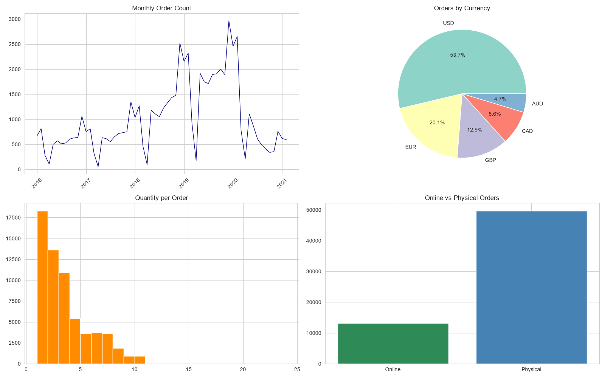
*Figure 1: Overall sales metrics -- revenue, orders, and units across the full period.*

### Customer Demographics

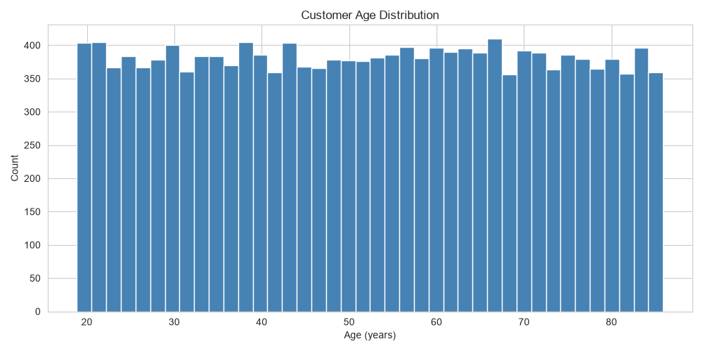
*Figure 2: Customer age distribution by gender. The customer base shows a balanced gender split across most age groups.*

### Top Customer States

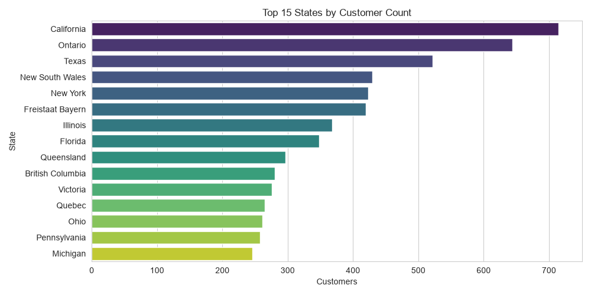
*Figure 3: Customers are concentrated in key Australian states, with New South Wales and Victoria being the largest markets.*

### Store Footprint

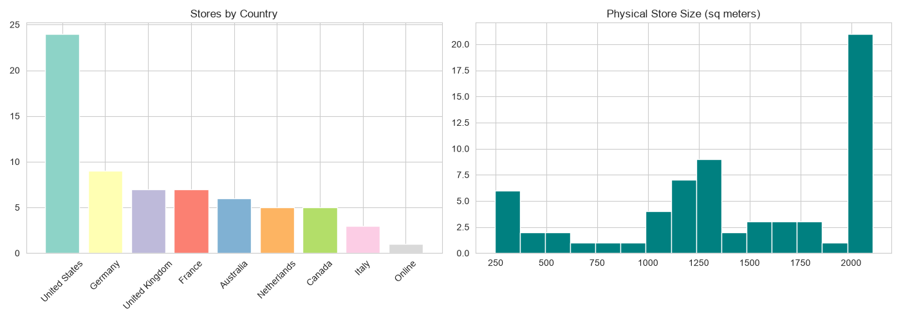
*Figure 4: Physical store sizes vary across countries; the Online channel has no physical footprint.*

### Exchange Rates

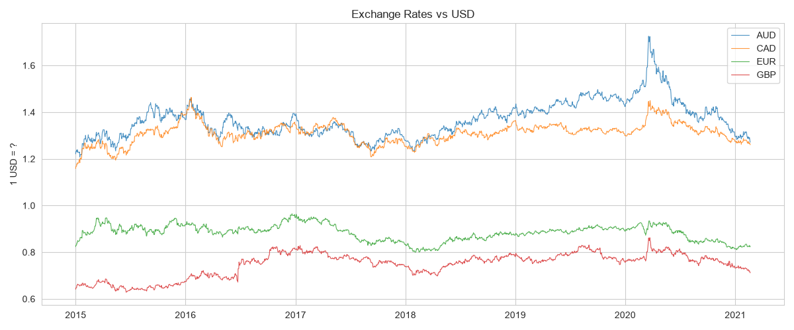
*Figure 5: Multi-currency environment -- daily exchange rates for USD, CAD, EUR, GBP, and AUD used for revenue normalization.*

---

## 3. The Growth Story (2016-2019)

Before the pandemic, Contoso was on a strong growth trajectory. Revenue nearly tripled over four years, driven by a combination of category expansion and increasing order volume.

### Year-over-Year Growth

| Year | Revenue | Orders | Growth |
|---|---|---|---|
| 2016 | $6,946,794 | 2,865 | -- |
| 2017 | $7,421,422 | 3,280 | +6.8% |
| 2018 | $12,788,961 | 5,965 | +72.3% |
| 2019 | $18,264,382 | 9,083 | +42.8% |
| 2020 | $9,294,632 | 4,635 | -49.1% |
| 2021* | $1,039,288 | 498 | -88.8% |

*2021 is partial data (Jan-Feb only)*

### What Drove the Growth?

The **Computers category** was the undisputed growth engine:
- Grew from $1.5M (2016) to $7.0M (2019) -- a +265% increase
- Contributed 48% of all revenue growth over the period
- By 2019, Computers alone accounted for nearly 40% of total revenue

Secondary growth drivers:
- **Cell Phones** -- contributed 16.6% of growth
- **Cameras and Camcorders** -- contributed 11.6% of growth

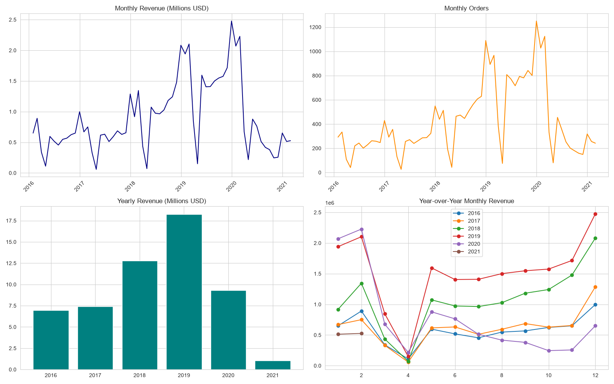
*Figure 6: Monthly revenue trends across all years. The consistent upward trajectory from 2016 through 2019 is clearly visible, as is the sharp COVID crash in early 2020.*

---

## 4. Product and Revenue Analysis

### Revenue by Category

Computers is the dominant category at $19.3M (34.6% of total revenue), followed by Home Appliances at $10.8M (19.4%).

| Category | Revenue | Percent | Profit | Margin |
|---|---|---|---|---|
| Computers | $19,301,595 | 34.6% | $11,277,448 | 58.4% |
| Home Appliances | $10,795,479 | 19.4% | $6,296,339 | 58.3% |
| Cameras and Camcorders | $6,520,168 | 11.7% | $3,919,801 | 60.1% |
| Cell Phones | $6,183,791 | 11.1% | $3,498,627 | 56.6% |
| TV and Video | $5,928,983 | 10.6% | $3,536,694 | 59.7% |
| Audio | $3,169,628 | 5.7% | $1,827,852 | 57.7% |
| Music Movies and Audio Books | $3,131,006 | 5.6% | $1,909,259 | 61.0% |
| Games and Toys | $724,829 | 1.3% | $396,669 | 54.7% |

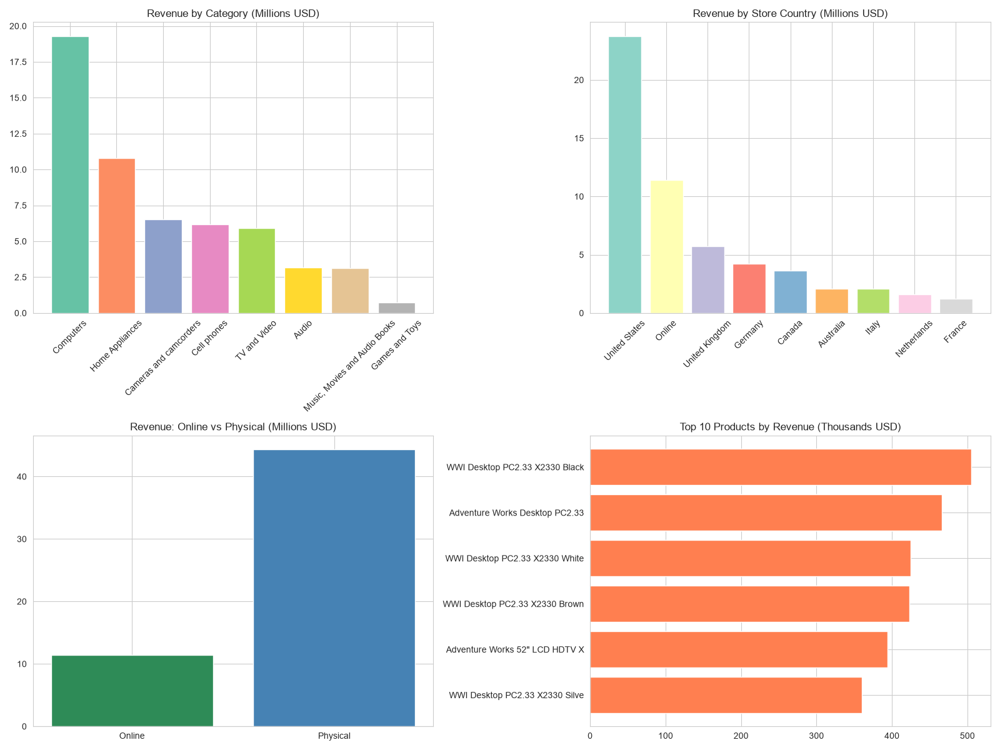
*Figure 7: Revenue breakdown by category, country, store type, and top products. Computers leads all categories.*

### Profit Margins are Remarkably Stable

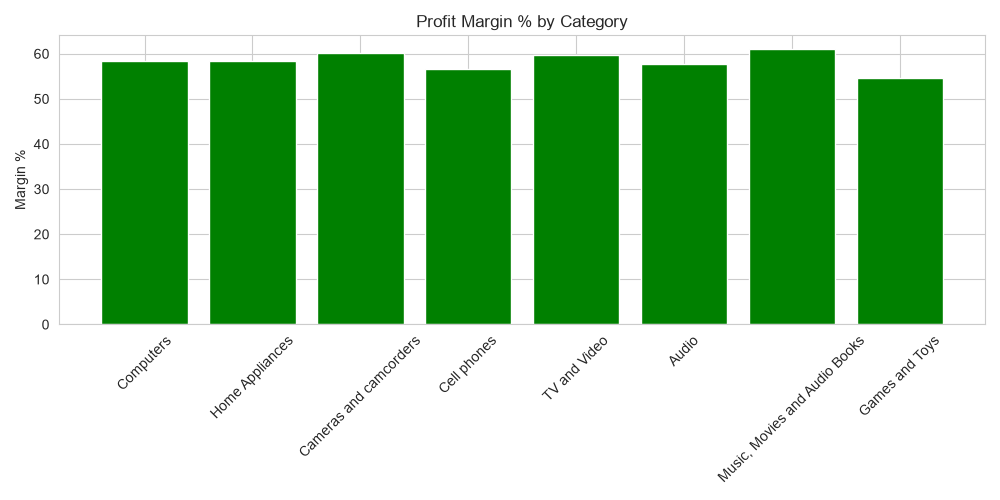
*Figure 8: Profit margins by category. All categories cluster tightly around 58%, with Music having the highest margin (61%) and Games and Toys the lowest (54.7%).*

**Key Insight:** Profit margins are stable within a narrow band of 54.7% to 61.0% across all categories. This consistency suggests disciplined pricing and cost management.

### Top-Selling Products

The top 10 products by revenue are dominated by **desktop computers**, with the top seller being **WWI Desktop PC2.33 X2330 Black** at $505,450 in revenue.

| Product | Revenue | Profit | Units |
|---|---|---|---|
| WWI Desktop PC2.33 X2330 Black | $505,450 | $337,986 | 550 |
| Adventure Works Desktop PC2.33 XD233 Silver | $466,089 | $311,664 | 481 |
| Adventure Works Desktop PC2.33 XD233 Brown | $464,151 | $310,368 | 479 |
| Adventure Works Desktop PC2.33 XD233 Black | $447,678 | $299,353 | 462 |
| Adventure Works Desktop PC2.33 XD233 White | $437,019 | $292,225 | 451 |

### Product Pricing and Cost Structure

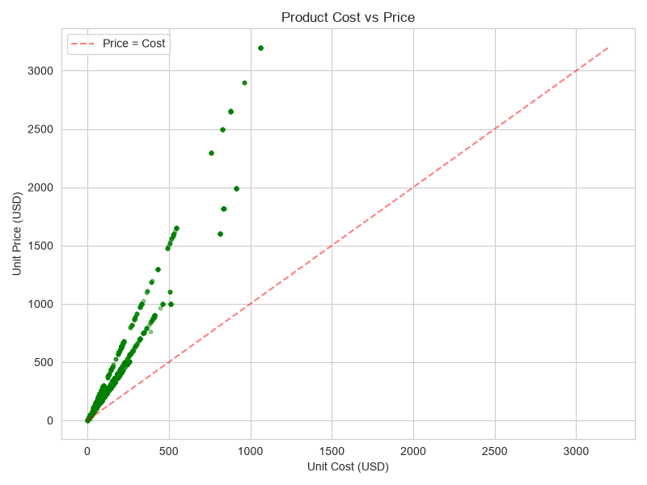
*Figure 9: Cost vs. price scatter plot shows the relationship between product cost and retail price across categories.*

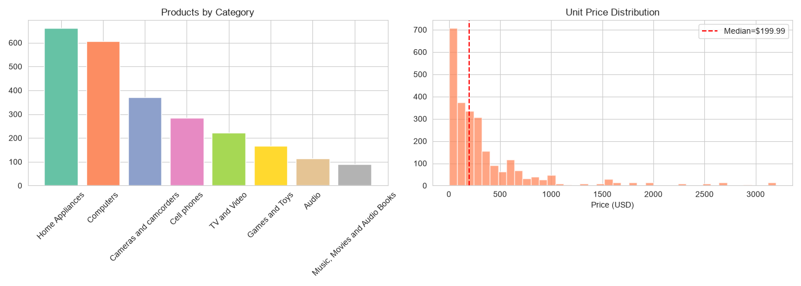
*Figure 10: Price distribution by category. Computers and TV and Video have the widest price ranges, including premium offerings.*

---

## 5. Geographic and Channel Performance

### Revenue by Country

The **United States** is Contoso's largest market at $23.8M (42.6% of total), followed by the **Online channel** at $11.4M (20.5%).

| Country | Revenue | Percent | Orders |
|---|---|---|---|
| United States | $23,764,426 | 42.6% | 11,153 |
| Online | $11,404,325 | 20.5% | 5,580 |
| United Kingdom | $5,749,770 | 10.3% | 2,784 |
| Germany | $4,246,279 | 7.6% | 1,902 |
| Canada | $3,611,562 | 6.5% | 1,769 |
| Australia | $2,099,141 | 3.8% | 901 |
| Italy | $2,059,087 | 3.7% | 890 |
| Netherlands | $1,591,344 | 2.9% | 776 |
| France | $1,229,546 | 2.2% | 571 |

### Online vs Physical Stores

| Channel | Revenue | Orders | Percent |
|---|---|---|---|
| Physical Stores | $44,351,155 | 20,746 | 79.5% |
| Online | $11,404,325 | 5,580 | 20.5% |

**Key Insight:** At 20.5% of revenue, the online channel is a significant contributor and proved slightly more resilient during COVID.

### Category Preferences by Gender

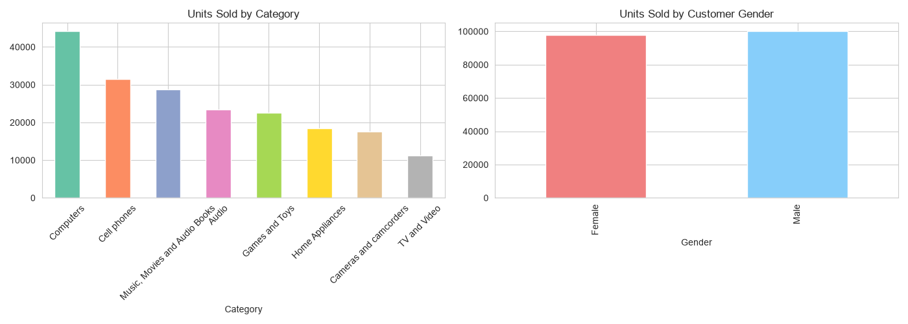
*Figure 11: Product category preferences across male and female customers, revealing shopping pattern differences.*

### Top Subcategories

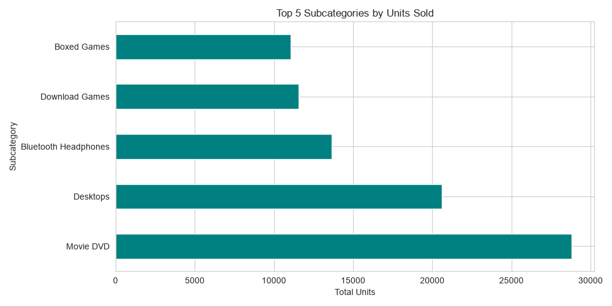
*Figure 12: Top-performing subcategories by revenue, providing granular insight into product-level performance.*

---

## 6. Customer Landscape

### Customer Demographics and Concentrations

All Contoso customers are based in **Australia**, concentrated in New South Wales and Victoria. The customer base spans ages from young adults to seniors, with a balanced gender split.

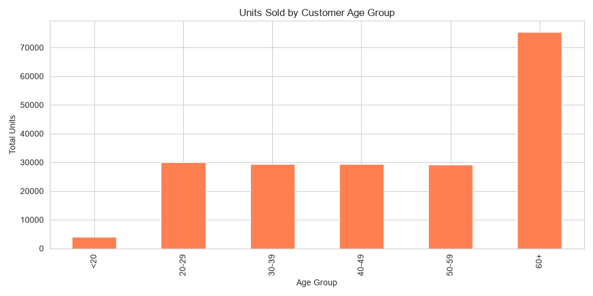
*Figure 13: Sales distribution by customer age group, showing which demographics contribute most to revenue.*

### Customer Value Segmentation (RFM Analysis)

We segmented 11,887 customers into five value tiers based on how recently they bought (Recency), how often they buy (Frequency), and how much they spend (Monetary).

| Segment | Customers | Avg Spend | Total Revenue | What It Means | Recommended Action |
|---|---|---|---|---|---|
| Champions | 3,155 | $9,525 | $30.1M | Buy recently, often, and spend the most | Reward and nurture |
| Loyal | 2,673 | $4,980 | $13.3M | Regular customers, good spend | Upsell and cross-sell |
| Potential | 2,983 | $2,938 | $8.8M | Moderate engagement | Grow the relationship |
| At Risk | 2,426 | $1,371 | $3.3M | Used to buy, but not recently | Re-engage campaigns |
| Lost | 650 | $465 | $302K | Long dormant | Win-back or retire |

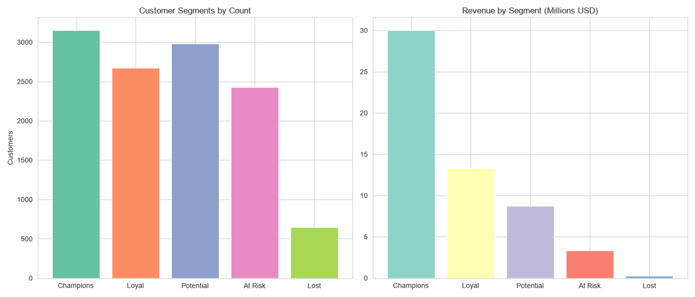
*Figure 14: Customer segments by count (left) and revenue contribution (right). Champions are the most valuable segment despite not being the largest.*

### Top Customers

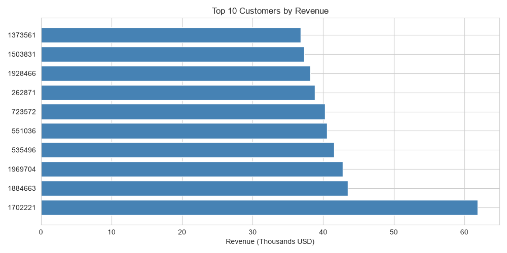
*Figure 15: Top 10 customers by lifetime revenue. The highest-value customer spent $61,872 across 9 orders.*

**Key Insight:** The top 10 customers collectively generated **$421,623 in revenue** -- an average of $42,162 per customer. These high-value individuals represent a critical segment for retention and referral programs.

---

## 7. Time Trends and Seasonality

### Monthly Revenue Trend (Full Period)

The time series reveals a clear pattern: strong, consistent growth from 2016 through 2019, followed by a dramatic COVID crash in early 2020, with no recovery through the end of the data period.

### Key Seasonal Patterns

- Q4 (Oct-Dec) is consistently the strongest quarter driven by holiday shopping
- **December** is the peak month each year
- **April** is consistently the lowest month (post-holiday slump, amplified by COVID)
- Monthly revenue more than doubled from 2016 to 2019 before crashing

### Top 5 Months All Time

| Month | Revenue | Orders |
|---|---|---|
| December 2019 | $2,477,296 | 1,250 |
| February 2020 | $2,227,380 | 1,124 |
| February 2019 | $2,102,863 | 967 |
| December 2018 | $2,082,206 | 1,089 |
| January 2020 | $2,068,951 | 1,027 |

*Note: February 2020 was the last pre-COVID peak -- the crash came in March 2020.*

### Quarterly Revenue

| Quarter | Revenue | Orders |
|---|---|---|
| Q4 2019 (Peak) | $5,768,125 | 2,893 |
| Q4 2020 | $1,153,875 | 626 |
| Q2 2020 (Trough) | $1,859,552 | 892 |

The quarterly view shows that Q4 2020 revenue was only **20%** of Q4 2019 levels -- a stark illustration of how far the business fell and how little it had recovered.

---

## 8. COVID-19 Impact and Recovery

This section presents findings from a dedicated investigation into how COVID-19 affected Contoso's business across categories, countries, and customer behavior.

### 8.1 The Revenue Crash

The pandemic hit Contoso with devastating speed:

- Pre-COVID monthly average: $946,282
- COVID trough (April 2020): **$217,642** -- a **-90% drop** from February 2020
- Full year 2020 revenue: $9.3M (**-49.1%** vs 2019)
- **No meaningful recovery** within the data period

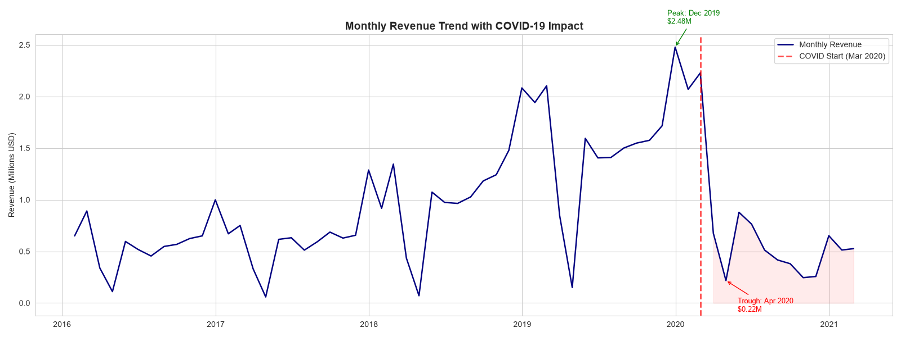
*Figure 16: Revenue trend showing pre-COVID growth (2016-2019), the sharp crash in March-April 2020, and the flat/low period that followed with no recovery.*

### 8.2 Category-Level Impact

Every category was hit hard but recovery rates varied significantly:

| Category | Pre-COVID Revenue | Post-COVID Revenue | Change | Recovery Rate |
|---|---|---|---|---|
| Home Appliances | $10,179,590 | $615,889 | -93.9% | 17.6% |
| Audio | $2,920,766 | $248,861 | -91.5% | 20.2% |
| TV and Video | $5,321,059 | $607,924 | -88.6% | 40.5% |
| Computers | $16,873,075 | $2,428,521 | -85.6% | 33.7% |
| Cell Phones | $5,323,008 | $860,783 | -83.8% | 31.9% |
| Cameras and Camcorders | $5,720,267 | $799,901 | -86.0% | 31.0% |
| Music Movies and Audio Books | $2,747,796 | $383,210 | -86.1% | 42.7% |
| Games and Toys | $632,328 | $92,501 | -85.4% | 30.2% |

*Recovery Rate = H2 2020 revenue as a percentage of H1 2019 revenue*

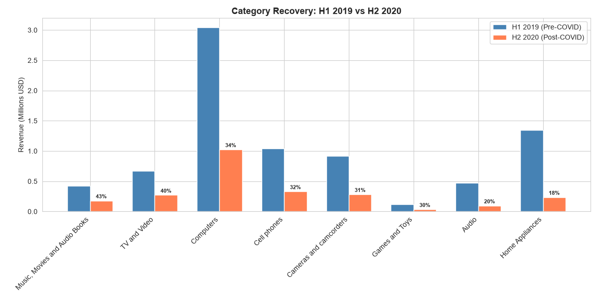
*Figure 17: Category recovery comparison. Music and Movies recovered best (42.7%) while Home Appliances struggled most (17.6%).*

**Key Insight:** Music, Movies and Audio Books recovered best (42.7% of pre-COVID levels), likely due to home entertainment demand. Home Appliances recovered worst (17.6%), likely due to deferred large purchases.

### 8.3 Margin Resilience -- A Bright Spot

Despite the crisis, profit margins remained **remarkably stable** across ALL categories, changing by no more than +/- 1 percentage point. This indicates that:

- The business did not resort to heavy discounting during the crisis
- Pricing discipline was maintained
- Cost structures remained intact

This is a significant positive finding -- the business preserved profitability even as revenue collapsed.

### 8.4 Customer Impact

The most concerning finding is the **massive customer churn**:

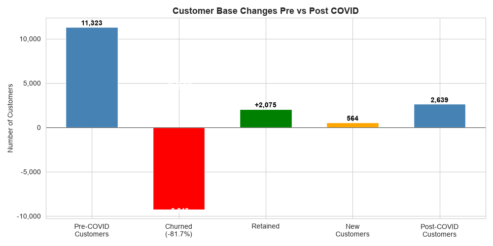
*Figure 18: Customer churn waterfall -- of 11,323 pre-COVID customers, only 2,075 (18.3%) returned.*

| Metric | Value |
|---|---|
| Pre-COVID customers | 11,323 |
| Customers who churned | **9,248 (81.7%)** |
| Customers retained | 2,075 (18.3%) |
| New customers acquired | 564 |
| Retained customer spend drop | **-48%** ($4,890 to $2,340) |

**Customer Value Comparison:**
- Retained customers: $7,229 avg spend (high value)
- Churned customers: $4,279 avg spend (moderate value)
- New customers: $2,098 avg spend (**51% lower than churned**)

**Key Insight:** New customers are worth only half of what lost customers were worth. This means the business is not only losing customers -- it is replacing them with lower-value ones.

### 8.5 Geographic Impact

All countries were severely impacted but with notable differences:

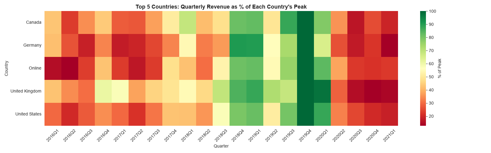
*Figure 19: Geographic heatmap of revenue decline across Contoso's markets.*

| Country | Revenue Change |
|---|---|
| Italy | -94.2% (hardest hit) |
| United Kingdom | -91.4% |
| Netherlands | -90.9% |
| Australia | -90.8% |
| Germany | -89.7% |
| Canada | -87.8% |
| United States | -87.1% |
| Online | -84.9% |
| France | -84.3% (least affected) |

### 8.6 Online vs Physical During COVID

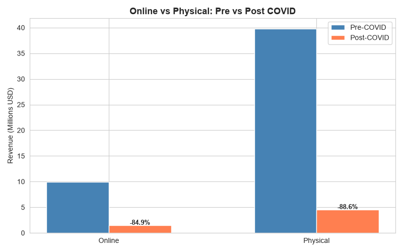
*Figure 20: Online vs Physical store performance during COVID. Online (-84.9%) proved slightly more resilient than physical (-88.6%).*

**Key Insight:** The online channel was more resilient but still severely impacted. A true e-commerce boom did not materialize for Contoso during the pandemic.

### 8.7 Recovery Outlook

- Post-COVID trend (Mar-Dec 2020): Continued slight decline (-$13,764/month)
- H2 2020 trend: Very slight improvement (+$2,257/month)
- Early 2021 signal: Jan-Feb average of $519,644 is 35% above Q4 2020 but still only **55% of pre-COVID baseline**
- At current H2 2020 recovery rates, full recovery would take approximately 20 years

**Conclusion:** The business has not shown meaningful recovery within the data period. Active intervention is needed -- a return to pre-COVID levels cannot be expected through organic recovery alone.

---

## 9. Delivery and Operations

### Delivery Performance

Our analysis of delivery data revealed important operational insights, though results are limited by data availability.

| Metric | Value |
|---|---|
| Orders with delivery data | 13,165 out of 62,884 (**20.9%**) |
| Orders missing delivery data | **49,719 (79.1%)** |
| Average delivery time | **4.5 days** |
| Median delivery time | **4 days** |
| Fastest delivery | 1 day |
| Slowest delivery | 17 days |
| Online average | 4.5 days |
| Physical stores | No delivery data recorded |

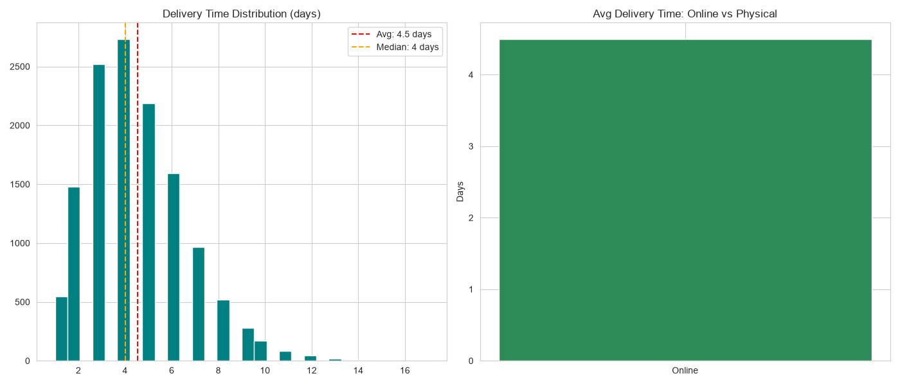
*Figure 21: Delivery time distribution (left) shows most orders delivered within 2-7 days. Online vs Physical comparison (right) shows similar average delivery times.*

### Critical Data Gap

**79.1% of orders are missing delivery dates.** This is a significant operations blind spot that makes it impossible to:
- Monitor fulfillment performance reliably
- Identify logistics bottlenecks
- Set data-driven delivery promises
- Compare delivery performance across countries or store types

**Recommendation:** Fixing delivery data collection should be a top operational priority.

---

## 10. Cross-Sell Opportunities

### Multi-Item Order Behavior

| Metric | Value |
|---|---|
| Total orders | 26,326 |
| Orders with multiple items | **17,128 (65.1%)** |
| Unique product pairs identified | **67,894** |

**65.1% of all orders contain multiple items** -- a strong signal that customers are open to cross-selling and bundle recommendations.

### Top Product Pairs

| Product A | Product B | Times Together |
|---|---|---|
| Contoso DVD Storage Binder | Contoso Touch Stylus Pen | 5 |
| Contoso DVD Portable Player | SV Hand Games | 5 |
| WWI Desktop PC (Brown) | WWI Desktop PC (White) | 4 |
| Wireless Bluetooth Headphones | Adventure Works Desktop PC | 4 |
| Adventure Works Desktop PC (Silver) | Adventure Works Desktop PC (White) | 4 |

### Top Category Pairs

| Category A | Category B | Frequency |
|---|---|---|
| **Cell Phones** | **Computers** | **3,339** |
| Computers | Music Movies and Audio Books | 2,956 |
| Audio | Computers | 2,439 |
| Computers | Games and Toys | 2,409 |
| Cell Phones | Music Movies and Audio Books | 2,330 |

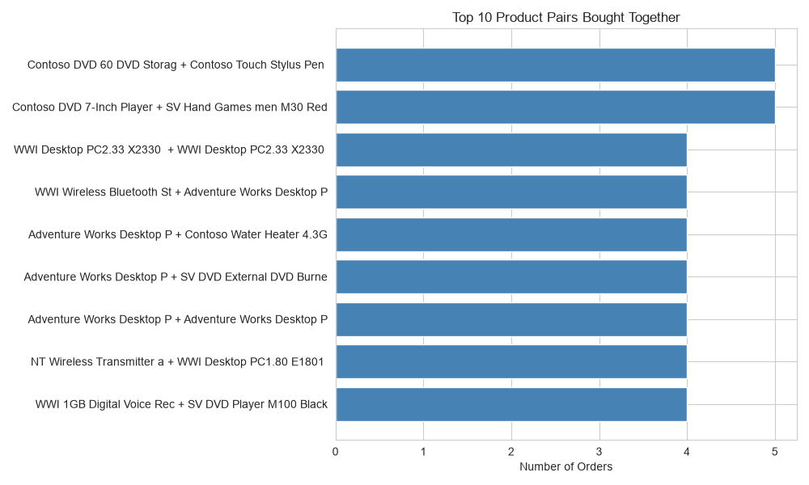
*Figure 22: Top 10 product pairs bought together, showing strong cross-sell patterns around computers and accessories.*

**Key Insight:** Cell phones and Computers are bought together most frequently -- customers buying one are highly likely to be interested in the other. This is a prime cross-sell opportunity for recommendation engines, email marketing, and in-store displays.

---

## 11. Executive Dashboard

The dashboard below consolidates all key metrics into a single visual overview of the business:

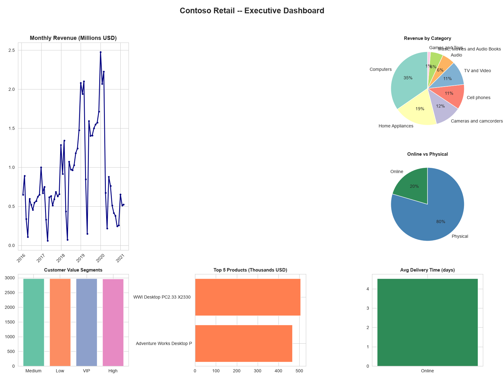
*Figure 23: Executive Dashboard -- 6-panel view covering monthly revenue trend, category mix, online vs physical split, customer value segments, top products, and delivery performance.*

### Quick Reference KPIs

| KPI | Value | Signal |
|---|---|---|
| Total Revenue | $55.8M | Declining since COVID |
| Profit Margin | 58.6% | Stable and healthy |
| Active Customers | 11,887 | 82% churned post-COVID |
| Online Share | 20.5% | Growth opportunity |
| Avg Delivery | 4.5 days | Only 21% data coverage |
| Top Category | Computers (34.6%) | Concentrated risk |
| Top Market | United States (42.6%) | Concentrated risk |
| Multi-Item Orders | 65.1% | Cross-sell opportunity |

---

## 12. Visual Index -- Complete Gallery

All 23 charts generated during this analysis are listed below, organized by category.

### Exploratory Analysis (10 Charts)

| Number | Chart Name | File | Content |
|---|---|---|---|
| 1 | Customer Age and Gender | 01_customers_age_gender.png | Age distribution by gender |
| 2 | Top Customer States | 02_customers_top_states.png | Geographic concentration |
| 3 | Category Price Distribution | 03_products_category_price.png | Price ranges by product category |
| 4 | Cost vs Price | 04_products_cost_vs_price.png | Product cost-price relationship |
| 5 | Store Sizes by Country | 05_stores_country_size.png | Physical store footprint |
| 6 | Sales Overview | 06_sales_overview.png | Overall sales metrics snapshot |
| 7 | Exchange Rate Trends | 07_exchange_rates.png | Multi-currency rates over time |
| 8 | Category by Gender | 08_cross_category_gender.png | Shopping preferences by gender |
| 9 | Top Subcategories | 09_top_subcategories.png | Best-selling subcategories |
| 10 | Sales by Age Group | 10_sales_by_age_group.png | Revenue contribution by age |

### Core Analysis (8 Charts)

| Number | Chart Name | File | Content |
|---|---|---|---|
| 11 | Revenue Overview | a1_revenue_overview.png | Revenue by category, country, channel, product |
| 12 | Margin by Category | a1_margin_by_category.png | Profit margin percent across categories |
| 13 | Customer Segments | a2_customer_segments.png | RFM segment counts plus revenue |
| 14 | Top Customers | a2_top_customers.png | Top 10 customers by revenue |
| 15 | Time Series Trends | a3_time_series.png | Monthly, yearly, YoY revenue trends |
| 16 | Delivery Overview | a4_delivery_overview.png | Delivery time distribution plus channel comparison |
| 17 | Product Affinity | a5_product_affinity.png | Top product pairs bought together |
| 18 | Executive Dashboard | a6_executive_dashboard.png | 6-panel KPI dashboard |

### COVID-19 Investigation (5 Charts)

| Number | Chart Name | File | Content |
|---|---|---|---|
| 19 | COVID Trend | investigation_covid_trend.png | Revenue before and during COVID |
| 20 | Category Recovery | investigation_category_recovery.png | Recovery rates by product category |
| 21 | Country Heatmap | investigation_country_heatmap.png | Geographic impact visualization |
| 22 | Customer Churn | investigation_customer_churn.png | Pre/post COVID customer waterfall |
| 23 | Store Type Impact | investigation_store_type.png | Online vs Physical during COVID |

---

## 13. Strategic Recommendations

Based on all findings, we recommend the following actions organized by priority and timeline.

### URGENT (0-6 Months)

**1. Launch a Customer Retention Program**
- Why: 82% customer churn is the single biggest threat to the business
- What: Targeted re-engagement campaigns for At Risk (2,426) and Lost (650) segments
- How: Email campaigns, personalized offers, loyalty program
- Target: The 2,075 retained customers are worth $7,229 each -- focus on keeping them

**2. Fix Delivery Data Collection**
- Why: 79% missing delivery dates is a critical operations blind spot
- What: Mandate delivery date recording at point of fulfillment
- Benefit: Enables performance monitoring, bottleneck detection, and customer promise setting

**3. Double Down on Computers**
- Why: Drove 48% of pre-COVID growth and shows highest recovery potential
- What: Targeted marketing campaigns featuring desktop PCs and accessories
- Benefit: Lean into your strongest category to accelerate recovery

### SHORT-TERM (6-12 Months)

**4. Improve Customer Acquisition Quality**
- Why: New customers spend $2,098 -- 51% less than churned customers ($4,279)
- What: Review acquisition channels, refine targeting, adjust marketing spend toward higher-LTV segments
- Benefit: Better ROI on marketing spend

**5. Revive Struggling Categories**
- Why: Home Appliances (17.6% recovery) and Audio (20.2%) are severely underperforming
- What: Evaluate promotions, pricing adjustments, assortment changes, or vendor negotiations
- Benefit: Recovery in these categories would add millions in revenue

**6. Conduct Italy Market Review**
- Why: -94.2% is the worst impact of any market -- may indicate structural issues beyond COVID
- What: Investigate supply chain, competition, local management, and market conditions
- Benefit: Determine whether Italy can recover or requires strategic restructuring

### MEDIUM-TERM (12-24 Months)

**7. Build a Cross-Sell Engine**
- Why: 65% of orders have multiple items; 67,894 product pairs identified
- What: Implement recommendation engine for online; train sales staff on top pairings
- Benefit: Increase average order value by surfacing relevant product combinations

**8. Invest in the Online Channel**
- Why: 20.5% of revenue and more COVID-resilient (-84.9% vs -88.6%)
- What: E-commerce platform improvements, online marketing, fulfillment optimization
- Benefit: Diversify revenue and build future-proof channel

**9. Diversify Revenue Sources**
- Why: Heavy dependence on Computers (48% of growth, 34.6% of revenue) is a concentration risk
- What: Invest in growing Cell Phones, Cameras, and other categories
- Benefit: Reduce vulnerability to category-specific disruptions

### Summary of Key Actions

| Priority | Action | Revenue Impact | Effort |
|---|---|---|---|
| URGENT | Customer retention program | Very High | Medium |
| URGENT | Fix delivery data collection | Medium | Low |
| URGENT | Double down on Computers | Very High | Low |
| SHORT-TERM | Improve acquisition quality | High | Medium |
| SHORT-TERM | Revive Home Appliances and Audio | High | Medium |
| SHORT-TERM | Italy market review | Medium | Medium |
| MEDIUM-TERM | Cross-sell engine | Very High | High |
| MEDIUM-TERM | Online channel investment | High | High |
| MEDIUM-TERM | Revenue diversification | Very High | High |

---

## 14. Appendix: Methodology and Data Notes

### Data Sources

This analysis is based on 6 CSV files from Contoso's retail database:

| Table | Rows | Key Content |
|---|---|---|
| Sales | 62,884 | Transactions with dates, quantities, currencies |
| Customers | 15,266 | Demographics (all Australian) |
| Products | 2,517 | Product details, costs, prices |
| Stores | 67 | Store locations (8 countries plus Online) |
| Exchange Rates | 11,215 | Daily rates for 5 currencies |

### Analysis Methods

| Area | Method |
|---|---|
| Revenue | Quantity x Unit Price USD (converted to USD via daily exchange rates) |
| Profit | Revenue minus Cost (Quantity x Unit Cost USD) |
| Customer Segmentation | RFM (Recency, Frequency, Monetary) scored 1-4 each, 5 segments |
| COVID Impact Split | Pre-COVID: Jan 2016 - Feb 2020; Post-COVID: Mar 2020 - Feb 2021 |
| Product Affinity | Pairwise combinations within same order (67,894 pairs) |

### Important Caveats

1. **2021 data is partial** (only January-February). All growth calculations note which years are complete.
2. **79.1% of orders lack delivery dates.** Delivery analysis is based on 20.9% of orders and may be biased.
3. **Revenue uses list prices** (Unit Price USD). Actual transaction prices may differ due to discounts.
4. **Pre/post COVID comparison periods differ in length** (4+ years vs about 1 year).
5. **Recovery projections** are based on simple linear trends (statistically weak fit).
6. **All customers are Australian** even though stores are global -- customer acquisition appears to be Australia-only.

### Tools Used

- **Python** (pandas, numpy, matplotlib, seaborn) for all analysis and visualization
- **Jupyter Notebooks** for interactive exploration and documentation
- **12 notebooks** and **11 Python scripts** comprise the full analytical pipeline

---

*This report was generated from the Contoso Retail Data Analytics repository. All data, code, and visualizations are reproducible and documented for transparency.*

**End of Report**
